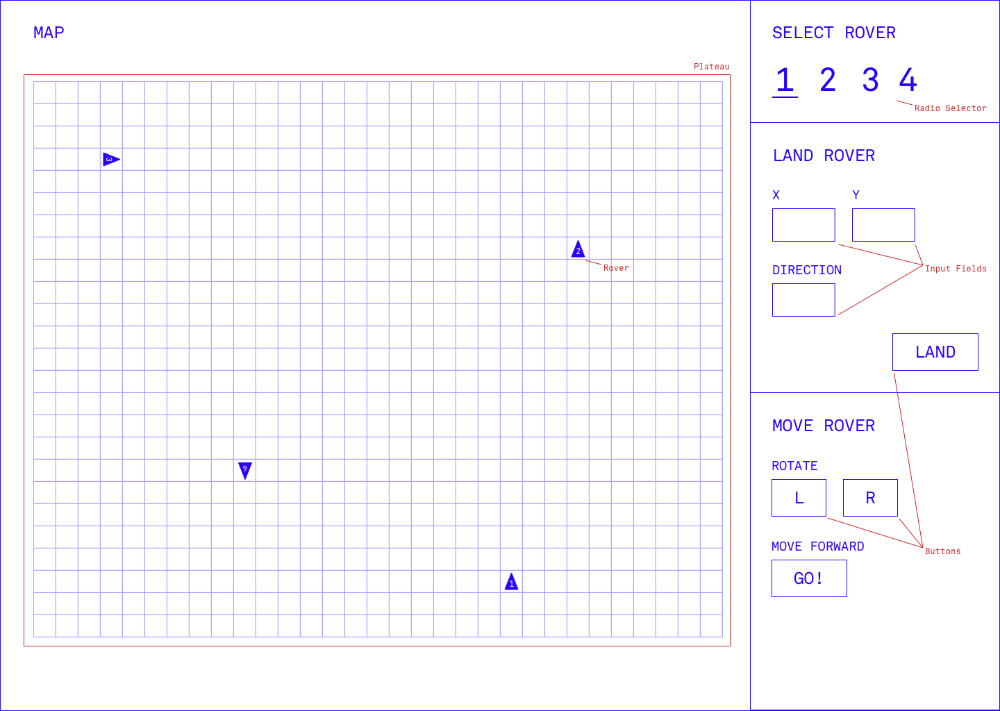

# rovers

This is a code test completed for an AI company in Toronto. I had a lot of fun with this.

The problem statement:

```
A squad of 4 robotic rovers are to be landed by NASA on a plateau on Mars.

Their engineers need an interface that gives them the ability to land rovers in pre-specified coordinates, control their movements across the plateau, and visualize their current position on a map.


A rover's position is represented by a combination of an x and y co-ordinates and a letter representing one of the four cardinal compass points. The plateau is divided up into a grid to simplify navigation. An example position might be 0, 0, N, which means the rover is in the bottom left corner and facing North.

In order to control a rover, NASA sends a simple string of letters using interface controls. The possible letters are 'L', 'R' and 'M'. 'L' and 'R' makes the rover spin 90 degrees left or right respectively, without moving from its current spot.

'M' means move forward one grid point, and maintain the same heading.

Assume that the square directly North from (x, y) is (x, y+1).

Input:
Configuration Input: The first line of input is the upper-right coordinates of the plateau, the lower-left coordinates are assumed to be 0,0.
Per Rover.Test Input:8 4

Input 1: Landing co-ordinates for the Rover The position is made up of two integers and a letter separated by spaces, corresponding to the x and y co-ordinates and the rover's orientation. Test Input:1 2 N

Input 2: Navigation instructions i.e a string containing ('L', 'R', 'M'). Test Input:LMLMLMLMM


Assumptions:
-NASA has a total of 4 rovers available in orbit for this mission.
-If a rover is driven off the plateau it is destroyed and unusable.
-Rovers can occupy the same position on the plateau.


Review the attached wireframe and use HTML, CSS, and Javascript to build an interface that can land rovers in pre specified coordinates then control their movements across the plateau.
```

And here's the wireframe:



I gave it an old-school CRT look, just because it's super quick, doesn't require assets, and it worked well with the theme. The challenge gave bonus points for changing or disregarding parts of the wireframe if it meant a better user experience. Generally I was pretty faithful, but I added the following:

-   The 'Move' and 'Land' interfaces never appear on the screen at the same time.
-   I added craters just for funsies--run into them and your rover is disabled.
-   The description referred to issuing text commands, so I added a 'sequence' field to the movement inputs, which shows your command string. As you click the buttons, it'll spit out the appropriate sequence: "LMRM" etc. You can actually type into that box too to move your rover... which also means you can undo your last moves just by deleting from the end of that string. (Pretty slick if I do say so myselfhg... Sorry, hard to type when I'm patting myself on the back.)

## Try it

Enough talk! Try the [demo](http://mark.moyes.ca/code-test-rovers/) (or just run it out of the `dist/` folder).

## Project setup

Install dependencies.

```
npm install
```

### Compiles and hot-reloads for development

```
npm run serve
```

### Compiles and minifies for production

```
npm run build
```

### Run unit tests

There are a limited number of unit tests included.

```
npm run test:unit
```
